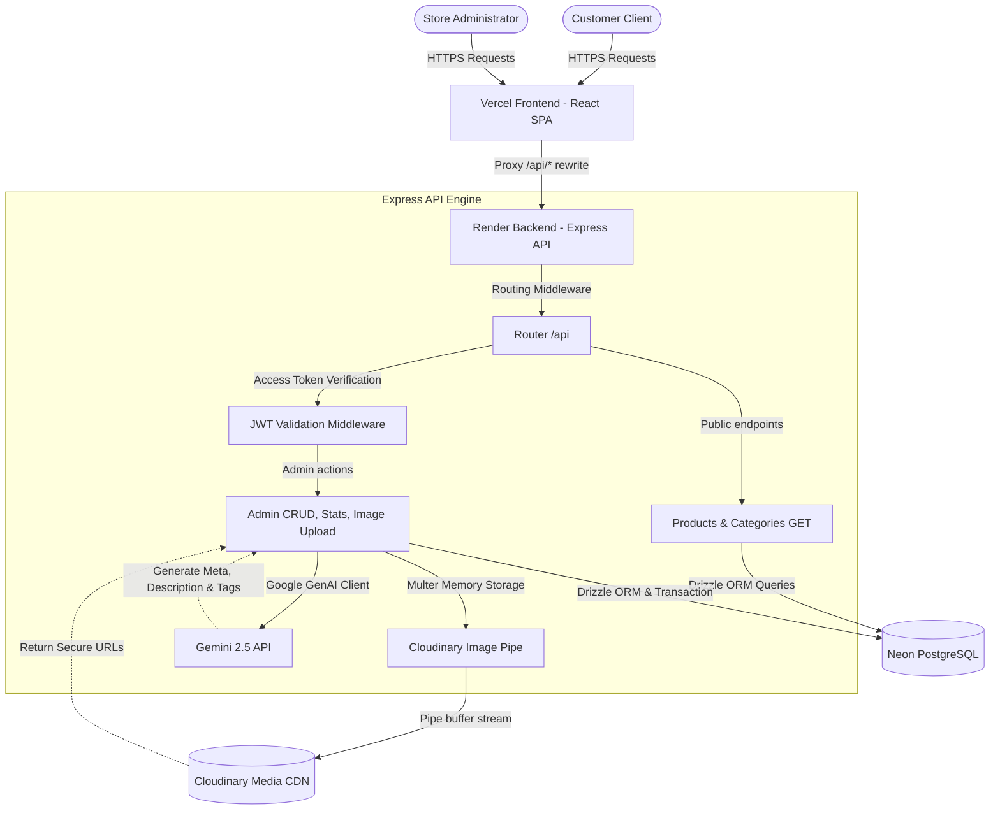

# Sri Lakshmi Ganapathi Photo Frame Works (SLG Photo Frames)

Sri Lakshmi Ganapathi Photo Frame Works (SLG Photo Frames) is a premium, full-stack digital showcase and inventory catalog system designed for a traditional devotional photo frame and gifting business established in 1985. 

This platform serves as a modern digital storefront, featuring an elegant, responsive customer-facing catalog and a highly secure, AI-powered admin dashboard for inventory management.

---

## 🏗️ Architecture Overview

The application is built on a split full-stack architecture, utilizing a decoupled React SPA on the frontend and an Express server on the backend. Production deployments utilize Vercel for fast frontend delivery and Render for hosting the backend API.



---

## 🌟 Key Features

### 👤 Customer-Facing Catalog
- **Devotional & Gifting Catalog:** Elegantly browse multiple categories including standard Photo Frames, LED Lighting Photos, Silver Gifts, Glass Boxes, and Custom Orders.
- **Dynamic Search & Filtering:** Instant text search across name, category, and description with dynamic sorting options (*Newest, Price: Low to High, Price: High to Low, Most Popular*).
- **Interactive Product Details:** 
  - Dynamic price updates based on selected dimensions/sizes.
  - Multi-image gallery with high-resolution swipe and thumbnail previews.
  - Custom tabs outlining detailed description, material specifications, and delivery timelines.
- **Inquiry & Orders (Inquiry-Based Checkout):**
  - **WhatsApp Order Integration:** Pre-fills detailed messages containing the exact product name, selected size, and final price.
  - **Quick Ask Queries:** Instant inquiry buttons for common customer questions (*Ask Price, Delivery Time, Customization, Bulk Order*).
  - **Gift Mode Toggle:** Customized wrapping and gift card message setup.
  - **Urgent Order Section:** Quick call and direct communication triggers.
- **Persistent Wishlist:** Client-side wishlist backed by local storage.
- **Premium Styling:** Customized dark/light theme switching with modern typography (Playfair Display & Inter), custom glassmorphism, and interactive micro-animations.

### 🔑 Store Admin Dashboard
- **Dashboard Stats:** High-level metrics showing total product count, active listing count, categories count, and a feed of recently created items.
- **Product CRUD Suite:** Visual workspace to add, edit, soft-delete, or permanently delete items, sizes, and images.
- **Drizzle Transactions:** Multi-table operations (products, product images, and product sizes) executed under transaction rollbacks to guarantee data consistency.
- **Gemini AI Product Generator:** Fully integrated content generator utilizing the Google Gemini API to write storefront descriptions, SEO-optimized titles/descriptions, frame types, tags, and automatically toggle flags based on product criteria.
- **Cloudinary Image Uploads:** Local files are uploaded in-memory as buffer streams directly to Cloudinary without creating slow, local temp files.
- **Permanent Assets Cleanup:** Deleting products permanently runs background deletions of hosted images on Cloudinary via their public IDs.

---

## 🛠️ Tech Stack

### Frontend
- **Framework & Build:** React 18, TypeScript, Vite
- **Styling & Components:** Tailwind CSS, Shadcn/UI (Radix UI primitives), Lucide React Icons
- **State & Fetching:** TanStack React Query (v5) for API caching and request states, React Router DOM (v6) for SPA page routing
- **UI Utilities:** Embla Carousel (for sliding galleries), Recharts (for potential future metrics), Sonner & Toast (for notifications)

### Backend
- **Server Environment:** Node.js, Express (v5)
- **Runtime Compiler:** `tsx` (TypeScript Execute watch runtime)
- **Database & ORM:** Serverless PostgreSQL (Neon Database), Drizzle ORM, Drizzle Kit (migrations manager)
- **File Uploads:** Multer (memory storage configuration)
- **Media Hosting:** Cloudinary Node.js SDK
- **AI Engine:** Google Gemini AI SDK (`@google/genai`)

---

## 📂 Folder Structure

```
├── backups/                    # Local backups generated during migrations
├── drizzle/                    # Drizzle migrations generated by drizzle-kit
│   ├── meta/                   # Migration snapshots
│   └── 0000_...sql             # SQL migration files
├── public/                     # Static assets served by Vite
│   └── uploads/                # Local uploads (fallback directory)
├── server/                     # Backend Workspace
│   ├── src/
│   │   ├── config/             # Cloudinary configuration
│   │   ├── db/                 # Drizzle schemas, migrations & connection pool
│   │   ├── middleware/         # Express auth middleware (JWT authentication)
│   │   ├── routes/             # API routes (Admin CRUD, Login, Gemini AI)
│   │   ├── scripts/            # CLI utilities (Seed, Cloudinary upload migration, Rollback, Migration report)
│   │   └── index.ts            # Server entry point and public endpoints
│   └── tsconfig.json           # Server compiler configuration
├── src/                        # Frontend Workspace
│   ├── assets/                 # Image assets (hero, categories, logo)
│   ├── components/             # Reusable UI components & shadcn controls
│   ├── config/                 # Static configuration (contact hours, WhatsApp)
│   ├── contexts/               # Theme & Wishlist context providers
│   ├── data/                   # Initial catalog static data for seeding
│   ├── hooks/                  # TanStack query and utility hooks
│   ├── lib/                    # HTTP client, Cloudinary URLs, tailwind utility
│   ├── pages/                  # Route components (Home, Catalog, Admin Dashboard)
│   ├── types/                  # API request/response TypeScript interfaces
│   ├── App.tsx                 # Client router definition
│   ├── main.tsx                # Client DOM entrypoint
│   └── index.css               # Tailwind directives & design system variables
├── drizzle.config.ts           # Drizzle schema path configurations
├── package.json                # Workspaces dependency definitions
├── tailwind.config.ts          # Tailwind tokens & visual details
├── vercel.json                 # Vercel CDN routing & rewrite settings
└── vite.config.ts              # Vite server & proxy configurations
```

---

## 🔑 Environment Variables

Create a `.env` file in the root directory. Do not commit this file to version control.

```ini
# --- DATABASE CONFIG ---
# Connection URL pointing to your Neon PostgreSQL instance
DATABASE_URL=postgresql://<user>:<password>@<host>/<database>?sslmode=require

# --- SECURITY ---
# JWT Secret key for signing admin authentication tokens
JWT_SECRET=your_super_secret_jwt_key_here

# --- DEFAULT ADMIN CREDS ---
# Input credentials used by the database seeding script
ADMIN_EMAIL=admin@slgphotoframes.com
ADMIN_PASSWORD=AdminSLG2026!

# --- CLOUDINARY CONFIG ---
# Storage API keys for image uploads
CLOUDINARY_CLOUD_NAME=your_cloudinary_cloud_name
CLOUDINARY_API_KEY=your_cloudinary_api_key
CLOUDINARY_API_SECRET=your_cloudinary_api_secret

# --- GEMINI AI CONFIG ---
# Developer key to authenticate with Google Gemini
GEMINI_API_KEY=your_gemini_api_key
```

---

## ⚙️ Installation & Local Setup

### Prerequisites
Make sure you have [Node.js](https://nodejs.org/) installed (v18+ recommended) and a running [PostgreSQL](https://www.postgresql.org/) database (or a [Neon](https://neon.tech/) account).

### 1. Clone the Project & Install Dependencies
```bash
git clone https://github.com/your-username/SLGPhotoFrames.git
cd SLGPhotoFrames
npm install
```

### 2. Configure the Environment
Copy or create a `.env` file in the root using the keys defined in the [Environment Variables](#-environment-variables) section.

### 3. Setup the Database Schema
Generate and run migrations to create the required tables in your PostgreSQL instance:
```bash
# Generate the SQL migration scripts
npm run db:generate

# Execute migration scripts against the DATABASE_URL
npm run db:migrate
```

### 4. Seed the Database
Populate the database with pre-configured category options, seed products, and the default admin credentials:
```bash
npm run db:seed
```

### 5. Start Development Servers
Run the frontend and backend servers concurrently:
```bash
npm run dev:all
```
- **Frontend Catalog:** Runs on [http://localhost:8080](http://localhost:8080) (Vite server proxied for API traffic)
- **Backend API:** Runs on [http://localhost:5000](http://localhost:5000)

---

## 📜 Available Scripts

Run these scripts from the project root using `npm run <script-name>`:

| Script | Command | Description |
| :--- | :--- | :--- |
| `dev` | `vite` | Starts the frontend Vite development server on port 8080. |
| `dev:backend` | `tsx watch server/src/index.ts` | Runs the backend Express server with hot-reload watch mode. |
| `dev:all` | `concurrently ...` | Launches the frontend and backend development environments simultaneously. |
| `build` | `vite build` | Compiles the production build of the React frontend into the `dist/` folder. |
| `start` | `tsx server/src/index.ts` | Boots up the Express server in production-like environments. |
| `test` | `vitest run` | Executes backend/frontend test scripts once. |
| `db:generate` | `drizzle-kit generate` | Compiles database schema changes in `schema.ts` into migrations. |
| `db:migrate` | `tsx server/src/db/migrate.ts` | Runs pending SQL migration files against the target database. |
| `db:seed` | `tsx server/src/scripts/seed.ts` | Clears target tables and seeds default categories, products, and admin. |
| `db:migrate-images`| `tsx server/src/...` | Migrates local upload images to Cloudinary, modifying database records. |
| `db:rollback-images`| `tsx server/src/...` | Restores a selected database state from JSON backups in `/backups`. |
| `db:migration-report`| `tsx server/src/...` | Generates a Markdown audit log listing local images that failed migration. |

---

## 📡 API Overview

### Public Endpoints
| Method | Endpoint | Description | Query Parameters |
| :--- | :--- | :--- | :--- |
| **GET** | `/api/health` | API service status check. | None |
| **GET** | `/api/categories` | Returns list of all categories. | None |
| **GET** | `/api/products` | Retrieve catalog products with filters & pagination. | `page`, `limit`, `category`, `search`, `sort` (`price-asc`/`price-desc`/`popular`/`newest`), `minPrice`, `maxPrice`, `featured` (`true`/`false`), `popular`, `customizable`, `material` |
| **GET** | `/api/products/:slugOrId`| Retrieve a single product by UUID or URL slug. | None |

### Admin Endpoints (Require valid JWT Header: `Authorization: Bearer <token>`)
| Method | Endpoint | Description | Request Body / Parameters |
| :--- | :--- | :--- | :--- |
| **POST** | `/api/admin/login` | Authenticate credentials & return JWT. *(No JWT required)* | `{ email, password }` |
| **GET** | `/api/admin/me` | Retrieve admin details for active sessions. | None |
| **GET** | `/api/admin/stats` | Dashboard numerical metrics & recently added list. | None |
| **POST** | `/api/admin/upload` | Upload image directly to Cloudinary. | Multipart Form-Data: `image` file |
| **GET** | `/api/admin/products` | Paginated product listing for admin tables. | `page`, `limit`, `category`, `status` (`published`/`draft`/`archived`/`inactive`), `search` |
| **GET** | `/api/admin/products/:id` | Fetch specific product details. | `:id` (UUID) |
| **POST** | `/api/admin/products` | Create a product, dimensions, and images in a transaction. | Complete product JSON payload |
| **PUT** | `/api/admin/products/:id`| Update details, replacing sizes and image lists. | Complete product JSON payload |
| **DELETE**| `/api/admin/products/:id`| Soft-deletes (sets status to `inactive`) or permanently deletes. | `permanent=true` query param |
| **POST** | `/api/admin/products/generate-details` | Generate copy-written metadata using Gemini AI. | `{ smallTitle, category, basePrice, sizes, materials }` |

---

## 🗄️ Database & Media Storage

### Database Schema Design
Drizzle ORM defines 5 core tables with strict relational mappings:
- **`categories`**: Identified by unique string keys (e.g. `'photo-frames'`).
- **`products`**: Linked to `categories`. Includes numeric base price, customized metadata, display orders, SEO tags, and flags.
- **`product_images`**: Cascade-deleted table holding multiple product image URLs linked to a product UUID.
- **`product_sizes`**: Custom dimensions paired with adjusted price values (e.g. `9x11 inches` -> `₹1500`).
- **`admins`**: Stores validated credentials with salted bcrypt hashes.

### Media Cloud Storage Migration
To replace legacy storage setups with Cloudinary, the system features built-in migration CLI routines:
- **Backup Generation:** Running `npm run db:migrate-images` copies the existing image table state into a timestamped JSON backup in `/backups/` before performing modifications.
- **Audit Reports:** If a local file does not exist, exceeds the **10MB upload limit**, or has an invalid extension, the script skips it and logs the reason into a generated file, `migration-report.md`.
- **Restoration / Rollback:** The CLI utility `npm run db:rollback-images` displays a list of backups, lets you choose an index, and rewrites the database table back to its original state.

---

## 🔒 Authentication Flow

```
[Admin Login Form]
       |
       |  1. POST /api/admin/login {email, password}
       v
[Express Admin Router]
       |
       |-- 2. Lookup user email (normalized to lowercase)
       |-- 3. Verify salted hash: bcrypt.compare(password, passwordHash)
       |-- 4. Sign token: jwt.sign({ id, email }, JWT_SECRET, { expiresIn: '24h' })
       v
[Client Browser]
       |
       |-- 5. Saves JWT token in local storage: 'admin_token'
       v
[Authenticated Request (e.g. Create Product)]
       |
       |-- 6. Sends Header: Authorization: Bearer <JWT_Token>
       v
[authenticateToken Middleware]
       |
       |-- 7. jwt.verify(token, JWT_SECRET)
       |-- 8. True -> Attach admin user metadata to req object -> next()
       |-- 9. False -> Return HTTP 403 Forbidden / 401 Unauthorized
```

---

## 🤖 AI Features (Google Gemini)

The Admin panel utilizes Google Gemini APIs to accelerate product seeding and catalog content writing.

- **Prompting Context:** The backend templates a detailed prompt supplying deity names, dimensions, selected materials, and pricing guidelines to Gemini, forcing a structured tone fit for a traditional devotional store.
- **Schema-Enforced Structure:** Utilizes a strict JSON schema configuration via `responseSchema` to guarantee the returned text parses perfectly into the database fields without post-processing failures.
- **Robust Model Fallbacks & Retries:** 
  - To prevent service interruptions, the API wraps calls in a retry handler with exponential delays.
  - If the primary model `gemini-2.5-pro` is overloaded or responds with a `503/UNAVAILABLE` error after 3 attempts, the system automatically falls back to `gemini-2.5-flash` to fulfill the request.

---

## ⚡ Performance Optimizations

1. **Database Indexing:** Crucial fields in the `products` table (`slug`, `categoryId`, `basePrice`, `featured`, `popular`, `status`) are indexed directly in PostgreSQL to ensure fast search, pagination, and sorting results.
2. **Relational Query Loading:** All endpoints utilize Drizzle’s relational querying syntax (`db.query.products.findMany({ with: { images: true, sizes: true } })`) to load nested relationships in single operations, preventing SQL N+1 query patterns.
3. **Connection Pooling:** The database client establishes a Node Postgres pool configured with strict connection limits (`max: 5`, timeouts, and error listeners) to prevent exceeding serverless database limits (e.g., Neon connection limits) during API auto-reloads.
4. **Cloudinary Dynamic Optimization:** Custom utilities in `src/lib/cloudinary.ts` inject optimization parameters on-the-fly to request specific dimensions, quality standards, and image types depending on the UI component:
   - **Card Listings:** `/upload/f_auto,q_auto,w_500/`
   - **Detail Viewer:** `/upload/f_auto,q_auto,w_1000/`
   - **Thumbnails:** `/upload/f_auto,q_auto,w_150/`
5. **Caching with React Query:** Frontend client queries are cached in memory. Transitioning pages or applying filters does not refetch duplicate data if the cache remains fresh.

---

## 🚀 Deployment Instructions

### Production Build & Compilation
```bash
# Build the production bundle (React outputs build static folder to /dist)
npm run build

# Preview build locally
npm run preview
```

### Backend (Render / Heroku)
1. Link your git repository to Render.
2. Choose **Web Service**.
3. Set the Environment variables in Render corresponding to the [Environment Variables](#-environment-variables) section.
4. Configure these fields:
   - **Build Command:** `npm install`
   - **Start Command:** `npm run start`

### Frontend (Vercel)
The project contains a pre-configured `vercel.json` file. It automatically maps routing paths:
- API endpoints starting with `/api/` rewrite traffic to your hosted backend url on Render (`https://slgphotoframes.onrender.com/api/:path*`).
- Media requests to `/uploads/` route to Render (`https://slgphotoframes.onrender.com/uploads/:path*`).
- All other routes fall back to `/index.html` to support client-side SPA routing.

To deploy:
1. Connect the repository to Vercel.
2. Vercel automatically reads the configuration and initiates the Vite build process.

---

## 📈 Future Improvements

- **Interactive Checkout:** Implement direct checkout integration via Razorpay or Stripe to allow purchases on-site.
- **Delivery Tracking:** Add shipping providers' API endpoints to supply tracking IDs and delivery status alerts.
- **SMS/WhatsApp Notifications:** Automate order status updates via Twilio or WhatsApp Business APIs.
- **Multi-Admin Permissions:** Introduce role-based access control for managing content.

---

## 🤝 Contributing & License

### Contributing
1. Fork the Project.
2. Create a Feature Branch (`git checkout -b feature/NewFeature`).
3. Commit your Changes (`git commit -m 'Add NewFeature'`).
4. Push to the Branch (`git push origin feature/NewFeature`).
5. Open a Pull Request.

### License
Distributed under the MIT License. See `LICENSE` for more information (if applicable).
